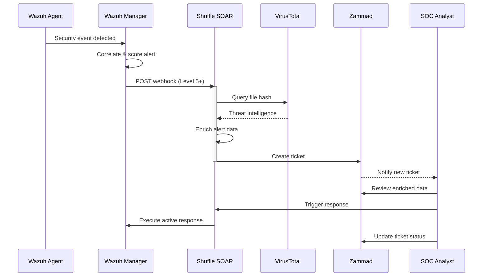

# Wazuh → Shuffle → Zammad Integration

> **End-to-end alert pipeline: Detection → Automation → Ticketing**

---

## Overview

This integration connects three core MCaaS components to create an automated security operations pipeline:

```
┌─────────┐      Webhook      ┌─────────┐      API      ┌─────────┐
│  Wazuh  │ ─────────────────▶│ Shuffle │────────────────▶│  Zammad │
│  SIEM   │                   │  SOAR   │                  │Helpdesk │
└─────────┘                   └─────────┘                  └─────────┘
   │                            │                           │
   │ Generates alerts           │ Enriches data             │ Tracks
   │ (Level 3+)                 │ Creates tickets           │ incidents
```

---

## Architecture

### Data Flow



---

## Configuration

### Step 1: Create Shuffle Webhook

1. **Login to Shuffle:** `https://kydoimos.mcaas.example.com`
2. **Create a new workflow:** "Wazuh Alert Handler"
3. **Add Webhook trigger:**
   - Drag "Webhook" trigger to canvas
   - Configure: Name = "Wazuh Alerts"
   - Save workflow
4. **Copy Webhook URL:**
   ```
   http://shuffle-backend.security-ops:3008/api/v1/webhooks/WEBHOOK_ID
   ```

### Step 2: Configure Wazuh Integration

**Method A: Via ossec.conf (Recommended)**

```bash
# Exec into Wazuh manager
kubectl exec -it -n wazuh statefulset/wazuh-manager-master -- /bin/bash

# Edit configuration
vi /var/ossec/etc/ossec.conf

# Add integration block:
<integration>
  <name>shuffle</name>
  <hook_url>http://shuffle-backend.security-ops:3008/api/v1/webhooks/WEBHOOK_ID</hook_url>
  <level>5</level>
  <format>json</format>
</integration>

# Restart Wazuh manager
/var/ossec/bin/wazuh-control restart
```

**Method B: Via API**

```bash
# Configure via Wazuh API
curl -k -X PUT \
  -H "Authorization: Bearer $TOKEN" \
  -H "Content-Type: application/json" \
  -d '{
    "integration": {
      "name": "shuffle",
      "hook_url": "http://shuffle-backend.security-ops:3008/api/v1/webhooks/WEBHOOK_ID",
      "level": 5,
      "format": "json"
    }
  }' \
  "https://wazuh-manager.wazuh:55000/manager/configuration"
```

### Step 3: Configure Shuffle to Create Zammad Tickets

1. **Get Zammad API Token:**
   - Login to Zammad: `https://alala.mcaas.example.com`
   - Profile → Token Access
   - Create token with `ticket.agent` permission

2. **Add Credentials in Shuffle:**
   - Admin → Credentials
   - Add new credential:
     - Name: `zammad-api-key`
     - Value: Your Zammad API token

3. **Add Zammad action to workflow:**
   - Drag "Zammad" app to canvas
   - Select action: `create_ticket`
   - Configure parameters:
     ```
     zammad_url: http://zammad-web.managed-it:80
     api_key: {{credentials.zammad-api-key}}
     title: [Alert] {{webhook_trigger.rule.description}}
     group: Users
     customer: security@mcaas.example.com
     article_body: {{webhook_trigger | json_pretty}}
     ```

### Step 4: Test Integration

```bash
# Trigger test alert
# From any Wazuh agent, generate authentication failure:
ssh invalid@localhost

# Or manually trigger webhook
curl -X POST \
  "http://shuffle-backend.security-ops:3008/api/v1/webhooks/WEBHOOK_ID" \
  -H "Content-Type: application/json" \
  -d '{
    "rule": {
      "id": "31533",
      "description": "Test integration alert",
      "level": 10
    },
    "agent": {
      "id": "001",
      "name": "test-workstation",
      "ip": "192.168.1.50"
    },
    "full_log": "Test log entry"
  }'

# Verify in Zammad
# Check for new ticket titled "[Alert] Test integration alert"
```

---

## Webhook Payload Format

### Wazuh to Shuffle

```json
{
  "agent": {
    "id": "001",
    "name": "workstation-001",
    "ip": "192.168.1.50",
    "labels": {
      "os": "Windows 10",
      "group": "security-ops"
    }
  },
  "rule": {
    "id": "31533",
    "level": 10,
    "description": "Multiple web authentication failures",
    "groups": ["authentication", "web"]
  },
  "timestamp": "2026-01-15T10:30:00Z",
  "full_log": "Jan 15 10:30:00 workstation-001 sshd[1234]: Failed password for user...",
  "data": {
    "srcip": "192.168.1.100",
    "dstuser": "admin",
    "srcport": "54321"
  }
}
```

### Available Fields in Shuffle

| Field | Description | Example |
|-------|-------------|---------|
| `webhook_trigger.rule.id` | Wazuh rule ID | `31533` |
| `webhook_trigger.rule.level` | Alert severity | `10` |
| `webhook_trigger.rule.description` | Alert description | `Multiple web authentication failures` |
| `webhook_trigger.agent.id` | Agent ID | `001` |
| `webhook_trigger.agent.name` | Hostname | `workstation-001` |
| `webhook_trigger.agent.ip` | Agent IP | `192.168.1.50` |
| `webhook_trigger.timestamp` | Event time | `2026-01-15T10:30:00Z` |
| `webhook_trigger.full_log` | Raw log | `...` |

---

## Workflow Configuration

### Sample Shuffle Workflow

```yaml
# Workflow: wazuh-alert-handler
name: Wazuh Alert Handler
trigger:
  type: webhook
  name: Wazuh Alerts

actions:
  # Enrich with VirusTotal
  - name: VirusTotal Lookup
    app: virustotal
    action: check_ip
    parameters:
      ip: "{{webhook_trigger.data.srcip}}"
    
  # Enrich with GeoIP
  - name: GeoIP Lookup
    app: geoip
    action: lookup
    parameters:
      ip: "{{webhook_trigger.data.srcip}}"
      
  # Create Zammad ticket
  - name: Create Ticket
    app: zammad
    action: create_ticket
    parameters:
      zammad_url: "http://zammad-web.managed-it:80"
      api_key: "{{credentials.zammad-api-key}}"
      title: "[{{webhook_trigger.rule.level}}] {{webhook_trigger.rule.description}}"
      group: "Security"
      customer: "{{webhook_trigger.agent.ip}}"
      article_body: |
        ## Security Alert
        
        **Severity:** {{webhook_trigger.rule.level}}
        **Agent:** {{webhook_trigger.agent.name}} ({{webhook_trigger.agent.ip}})
        **Time:** {{webhook_trigger.timestamp}}
        
        ### Alert Details
        {{webhook_trigger.rule.description}}
        
        ### Raw Log
        ```
        {{webhook_trigger.full_log}}
        ```
        
        ### Enrichment
        - **IP Reputation:** {{VirusTotal Lookup.virustotal.reputation}}
        - **Geo Location:** {{GeoIP Lookup.geoip.country}}
        - **ISP:** {{GeoIP Lookup.geoip.isp}}

  # Send notification (for high severity)
  - name: Email Notification
    app: email
    action: send
    condition: "{{webhook_trigger.rule.level}} >= 10"
    parameters:
      to: "security-team@mcaas.example.com"
      subject: "Critical Security Alert - {{webhook_trigger.rule.description}}"
      body: "Ticket created: {{Create Ticket.ticket.number}}"
```

---

## Troubleshooting

### Issue: Wazuh not sending webhooks

**Check:**
```bash
# Verify integration is configured
kubectl exec -n wazuh wazuh-manager-master-0 -- \
  cat /var/ossec/etc/ossec.conf | grep -A5 integration

# Check Wazuh logs
kubectl logs -n wazuh wazuh-manager-master-0 | grep shuffle

# Verify webhook URL is accessible
kubectl exec -n wazuh wazuh-manager-master-0 -- \
  curl -s http://shuffle-backend.security-ops:3008/api/v1/health
```

**Fix:**
```bash
# Restart Wazuh manager
kubectl rollout restart statefulset/wazuh-manager-master -n wazuh

# Verify network connectivity
kubectl exec -n wazuh wazuh-manager-master-0 -- \
  nc -zv shuffle-backend.security-ops 3008
```

### Issue: Shuffle not creating tickets

**Check:**
```bash
# Check Shuffle logs
kubectl logs -n security-ops -l app=shuffle-backend --tail=100

# Verify Zammad connectivity
curl -s \
  -H "Authorization: Token token=YOUR_TOKEN" \
  http://zammad-web.managed-it:80/api/v1/tickets

# Check credentials are configured
# Shuffle UI → Admin → Credentials
```

**Fix:**
```bash
# Verify credential name matches workflow
# Check Zammad API token is valid

# Test Zammad API manually
curl -X POST \
  -H "Authorization: Token token=$TOKEN" \
  -H "Content-Type: application/json" \
  -d '{"title":"Test","group_id":1}' \
  http://zammad-web.managed-it:80/api/v1/tickets
```

### Issue: Tickets missing enrichment data

**Check:**
- Verify enrichment apps are configured in Shuffle
- Check VirusTotal/AbuseIPDB API keys
- Review workflow execution logs in Shuffle

---

## Security Considerations

### Network Security

- Webhook traffic is internal to cluster (no TLS required)
- Zammad API uses internal service URL
- All external communications via Shuffle apps

### Authentication

| Component | Auth Method | Storage |
|-----------|-------------|---------|
| Wazuh → Shuffle | None (internal) | N/A |
| Shuffle → Zammad | API Token | Kubernetes Secret |
| Shuffle → VirusTotal | API Key | Kubernetes Secret |

### Secret Management

```bash
# Store credentials in Kubernetes secrets
kubectl create secret generic shuffle-credentials \
  --from-literal=zammad-token=YOUR_TOKEN \
  --from-literal=virustotal-key=YOUR_KEY \
  -n security-ops

# Mount to Shuffle deployment
kubectl patch deployment shuffle-backend -n security-ops \
  --patch='{"spec":{"template":{"spec":{"containers":[{"name":"shuffle","env":[{"name":"ZAMMAD_TOKEN","valueFrom":{"secretKeyRef":{"name":"shuffle-credentials","key":"zammad-token"}}}]}]}}}}'
```

---

## Performance Optimization

### Tuning Webhook Throughput

| Setting | Default | Recommended |
|---------|---------|-------------|
| Wazuh alert level | 5 | 7 (reduce noise) |
| Shuffle workers | 1 | 3-5 |
| Zammad rate limit | 50/min | 100/min |

### Monitoring Integration Health

```bash
# Check webhook latency
time curl -X POST \
  "http://shuffle-backend.security-ops:3008/api/v1/webhooks/ID" \
  -H "Content-Type: application/json" \
  -d '{"test":"data"}'

# Monitor ticket creation rate
kubectl logs -n security-ops -l app=shuffle-backend | \
  grep "create_ticket" | wc -l

# Check for failed deliveries
kubectl logs -n wazuh wazuh-manager-master-0 | \
  grep -i "integration\|webhook"
```

---

## API Reference

### Shuffle Webhook Endpoint

```
POST /api/v1/webhooks/{webhook_id}
Content-Type: application/json

Body: Wazuh alert JSON payload
```

### Zammad Ticket Creation

```
POST /api/v1/tickets
Authorization: Token token={api_token}
Content-Type: application/json

Body:
{
  "title": "string",
  "group_id": integer,
  "state_id": 1,
  "priority_id": integer,
  "customer_id": integer,
  "article": {
    "subject": "string",
    "body": "string",
    "type": "note"
  }
}
```

---

*Integration Version: 1.0*  
*Last Updated: January 2026*
